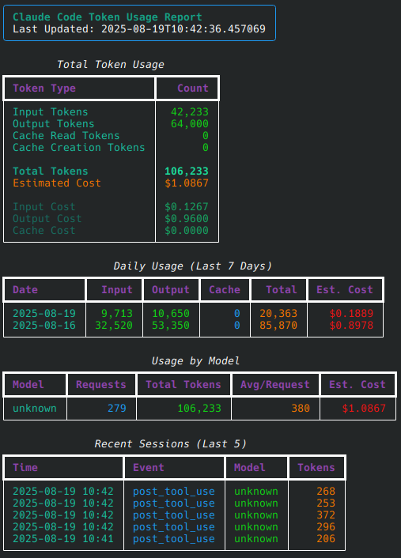

<div align="center">

# **My Central Configuration Hub for Claude Code**

[](https://claude.ai/code)
[](https://docs.anthropic.com/en/docs/claude-code)

</div>

## Overview

This repository serves as the **main Claude Code configuration repository** - a centralized, configuration that can be accessed from any Claude Code instance.

## Quick Start

### Installation

1. [Setup Claude Code](https://docs.anthropic.com/en/docs/claude-code/setup)

2. **Clone this repository to your home directory:**
   ```bash
   git clone https://github.com/dominicnunez/claude-code.git ~/.claude
   ```

## Core Features

### 🤖 Sub-Agents

Specialized AI agents that handle specific tasks with custom system prompts and tools.

#### Available Agents

| Agent                              | Purpose                                   | Model   |
| ---------------------------------- | ----------------------------------------- | ------- |
| **meta-agent**                     | Creates and modifies other agents         | Opus    |
| **gad**                            | Go architecture design specialist         | Default |
| **god**                            | Go implementation specialist              | Default |
| **go-learn**                       | Analyzes Go codebases to extract patterns | Default |
| **go-project-agent**               | Enhances Go agents with project patterns  | Default |
| **nixa**                           | NixOS configuration specialist            | Default |
| **rick-sanchez-coder**             | Cynical but effective coding assistant    | Default |
| **horror-writer**                  | Creative writing specialist               | Default |
| **pyad**                           | Python architecture design                | Default |
| **pydv**                           | Python development specialist             | Default |

#### Creating New Agents

Use the meta-agent to create a new base sub-agent that can be further refined as needed.

Agents are markdown files with YAML frontmatter:

```yaml
---
name: my-agent
description: Use this agent when... (critical for automatic delegation)
tools: Read, Write, Bash  # Optional - inherits all if omitted
model: opus  # Optional - haiku | sonnet | opus
---

# Purpose
You are a [role definition].

## Instructions
1. Specific task instructions
2. How to process information
3. How to report results
```

### 🪝 Hook System

Hooks extend Claude Code's capabilities with custom logic at key lifecycle events.

#### Available Hooks

| Hook                   | Trigger                  | Can Block? | Purpose                               |
| ---------------------- | ------------------------ | ---------- | ------------------------------------- |
| **user_prompt_submit** | Before prompt processing | ✅         | Validation, context injection         |
| **pre_tool_use**       | Before tool execution    | ✅         | Security checks, parameter validation |
| **post_tool_use**      | After tool completion    | ❌         | Logging, result validation            |
| **stop**               | When Claude finishes     | ✅         | Completion validation                 |
| **session_start**      | New/resumed session      | ❌         | Context loading                       |
| **notification**       | Claude notifications     | ❌         | User alerts                           |
| **subagent_stop**      | Subagent completion      | ✅         | Task validation                       |
| **pre_compact**        | Before compaction        | ❌         | Backup, logging                       |

#### Hook Implementation

Hooks are UV single-file Python scripts:

```python
#!/usr/bin/env -S uv run --script
# /// script
# requires-python = ">=3.11"
# dependencies = []
# ///

import sys
import json

# Read input from stdin
data = json.loads(sys.stdin.read())

# Process the hook data
if dangerous_pattern_detected(data):
    print("BLOCKED: Dangerous operation", file=sys.stderr)
    sys.exit(2)  # Exit code 2 blocks execution

# Normal completion
sys.exit(0)
```

## Token Tracking

The repository includes a token tracking system that monitors Claude Code usage:

**Note: stats are only updated when a claude session is closed**



- **Automatic tracking** via `token_tracker.py` hook
- **Usage reports** stored in `token_usage.json`
- **Session and daily statistics**
- **Model-specific breakdowns**

View usage:

```bash
uv run ~/.claude/token_usage_report.py
```

**Note: stats are only updated when a claude session is closed**

## Resources

- [Claude Code Documentation](https://docs.anthropic.com/en/docs/claude-code)
- [Claude Code Sub-Agents](https://docs.anthropic.com/en/docs/claude-code/sub-agents)
- [Claude Code Hooks](https://docs.anthropic.com/en/docs/claude-code/hooks)
- [Claude Code Issue Tracker](https://github.com/anthropics/claude-code/issues)

## License

This configuration repository is provided as-is for Claude Code users. Customize and extend as needed for your development workflow.

---

<div align="center">

**Built for developers who value automation, consistency, and intelligent tooling**

</div>
